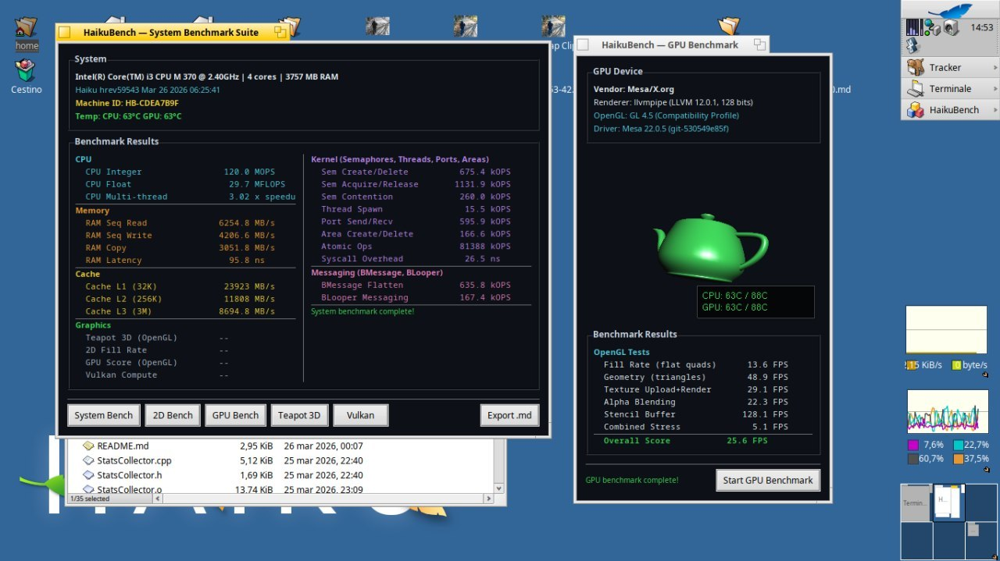

# HaikuBench for Haiku

Native Haiku benchmark suite that measures the performance of CPU, memory, cache, kernel primitives, messaging, 2D graphics, OpenGL and Vulkan — with reproducible, statistically sound results (adaptive sampling, trimmed mean, p50/p95, CoV) exported in Markdown and JSON for easy comparison and leaderboard aggregation.



If HaikuBench is useful to you, consider supporting development: [](https://buymeacoffee.com/atomozero)


## Features

* Native Haiku GUI: one window, one click per benchmark, or **Run All** to sequence every suite
* **Tabbed benchmark deck**: 2D, GPU, Vulkan and Teapot benchmarks in one tabbed window; GL animation is paused on hidden tabs
* **Demoscene splash screen**: a rotating red teapot with the title orbiting it, drawn entirely with the app_server 2D API — it runs even on installs with **no OpenGL/Mesa** at all; disable it from the **Settings** menu (persisted) or with `HAIKUBENCH_NOSPLASH=1`
* **System Bench**: 20 tests across CPU, memory, cache, kernel primitives and messaging
* **Adaptive sampling**: warms up, then keeps sampling until the coefficient of variation drops below 2% (3–10 runs), reporting trimmed mean, stddev, p50, p95 and sample count
* **2D Benchmark**: 24 BView rendering tests across 6 levels, with automatic 2D hardware-acceleration detection
* **GPU Benchmark**: 6 OpenGL tests plus an unambiguous **hardware-acceleration proof** (GPU vs software A/B comparison with CPU-load evidence)
* **Vulkan Benchmark**: 4 compute/bandwidth tests, loaded dynamically so a missing driver never crashes the app
* **Teapot 3D**: interactive OpenGL demo, 1 to 64 Phong-lit Utah Teapots
* **SPEC-style scoring**: composite score across 8 categories, baseline = 1000
* Unique per-machine hardware fingerprint (**Machine ID**) so results from different systems can be collected and ranked
* Live **ACPI temperature monitoring** in the main window and as an overlay on every benchmark
* Export to Markdown (human-readable) and JSON (machine-readable) for leaderboards
* **Localized** with the Haiku Locale Kit (English and Italian; more languages are a translation file away)
* **Scriptable via `hey`**: read the score/results and trigger benchmarks from the command line for automation and CI
* No external dependencies beyond Haiku system libraries and Mesa/Vulkan

## Quick start

```
pkgman install mesa_devel glu_devel
make
./HaikuBench
```

Optional Vulkan support:

```
pkgman install vulkan_devel mesa_lavapipe shaderc_devel
```

The GUI window lists every benchmark. Run them individually, or click **Run All** to sequence the full suite, then **Export .md** to save the report to the Desktop.

### The benchmarks

**System Bench — 20 tests, adaptive sampling.** Every test warms up the CPU for 200 ms, then samples adaptively: at least 3 runs, up to 10, stopping as soon as the coefficient of variation drops below 2%. The UI and exports report the trimmed mean (robust to a single outlier via the MAD rule) along with stddev, p50, p95 and the actual number of samples taken.

| Section | Tests | What it measures |
|---------|-------|------------------|
| **CPU** (3) | Integer, Float, Multi-thread | Arithmetic throughput, transcendentals, HT/multi-core scaling |
| **Memory** (4) | Seq Read, Seq Write, Copy, Latency | DDR bandwidth and random-access latency (pointer-chasing) |
| **Cache** (3) | L1, L2, L3 | Per-level bandwidth with 8 independent accumulators |
| **Kernel** (8) | Semaphores, Threads, Ports, Areas, Atomics, Syscalls | Haiku kernel primitive throughput and overhead |
| **Messaging** (2) | BMessage Flatten, BLooper | Haiku IPC serialization and looper round-trip |

**2D Benchmark — 24 tests, 6 levels.** All rendering through BView, no GPU required. Detects whether 2D hardware acceleration is active by identifying the accelerant driver via `BScreen::GetDeviceInfo()` and `ioctl B_GET_ACCELERANT_SIGNATURE`, and reports device name, chipset, VRAM and individual hook availability (FillRect, ScreenBlit, InvertRect).

| Level | Theme | Tests |
|-------|-------|-------|
| 1 | Basic Fills | FillRect, StrokeRect, FillRoundRect, StrokeLine |
| 2 | Geometry | FillTriangle, FillEllipse, FillPolygon, DrawString |
| 3 | Compositing | BShape curves, gradients, alpha blending, bitmap scaling |
| 4 | Advanced | 24-point star, clipped regions, conic gradients, text storm |
| 5 | Extreme | Nebula particles, fractal trees, plasma renderer, everything combined |
| 6 | Software 3D | Teapot wireframe, flat-shaded, x4 rotating, x16 army |

**GPU Benchmark — 6 tests, OpenGL.** Fill Rate (200 full-screen quads/frame), Geometry (10 000 triangles/frame), Texture (256×256 re-upload + 50 textured quads), Alpha Blending (300 overlapping quads), Stencil Buffer (100 masks + 150 masked draws) and Combined Stress (25 rotating lit objects). Includes a live rotating teapot preview during idle.

The window shows a badge stating whether the active renderer is a hardware GPU driver or a software rasterizer (from `GL_RENDERER`). On a hardware driver the suite re-runs the exact same six tests in a child process forced onto the software renderer (`HGL_SOFTWARE=1`) and reports three columns — GPU FPS, CPU FPS and the speedup factor — plus the CPU load measured during each pass: a GPU pass keeps the CPU nearly idle while a software pass saturates every core. Together these numbers demonstrate unambiguously that rendering happens on the GPU.

**Vulkan Benchmark — 4 tests.** Memory Bandwidth (host-visible 64 MB write throughput), Compute Shader (1M invocations × 256 FMA ops, GFLOPS), Buffer Copy (device-to-device 32 MB) and Buffer Fill (64 MB). Vulkan is loaded dynamically at runtime; if the loader or a driver (e.g. mesa_lavapipe) is not installed, the benchmark shows an error message instead of crashing. The compute shader is compiled from GLSL at runtime using glslc (shaderc).

**Teapot 3D — interactive OpenGL demo.** Renders 1 to 64 Utah Teapots with Phong lighting via BGLView. Use the +/- buttons to add or remove teapots and watch the FPS counter.

### 2D hardware acceleration detection

The 2D panel reports the video card's acceleration status: active accelerant **Driver** (e.g. `intel_extreme.accelerant`), **Device** name/chipset/VRAM, **2D Acceleration** verdict (ACTIVE vs NONE), and **Hooks** availability. Detection uses `ioctl B_GET_ACCELERANT_SIGNATURE` on `/dev/graphics/` and classifies the driver against the known set:

| Driver | 2D Acceleration |
|--------|-----------------|
| intel_extreme, radeon_hd, radeon, nvidia, ati, matrox, via, intel_810 | Hardware accelerated |
| vesa, framebuffer, virtio_gpu | Software only |

### Export

Clicking **Export .md** generates two files on the Desktop:

- `HaikuBench_YYYY-MM-DD_HH-MM-SS.md` — human-readable report
- `HaikuBench_YYYY-MM-DD_HH-MM-SS.json` — machine-readable data

Both include the app version, date, Machine ID, full system info (CPU, cores, RAM, OS version), every benchmark result (mean, stddev, p50, p95, CoV) and the overall composite score broken down by subsystem.

```json
{
  "format_version": 1,
  "app_version": "1.3.0",
  "machine_id": "HB-A3F7B21C",
  "hardware": "Intel Core i3 M 370 | 4 cores | 3757 MB RAM",
  "os": "Haiku hrev59722",
  "system_bench": {
    "valid": true,
    "runs": 5,
    "results": {
      "cpu_integer_mops": {
        "mean": 59.10, "stddev": 0.30,
        "median": 59.05, "p95": 59.50,
        "min": 58.70, "max": 59.60,
        "cov": 0.005, "trimmed_mean": 59.08,
        "n_samples": 3, "n_dropped": 0
      }
    }
  },
  "graphics": {
    "teapot": "Teapot 3D: 25 FPS (4 teapots)",
    "bench_2d": "2D Bench: 18795 fill/s | nebula 5215.3/s | extreme 14.3/s",
    "gpu_opengl": "GPU Bench: 24.1 FPS (...)",
    "vulkan": null
  }
}
```

### Temperature monitoring

ACPI thermal zones are read in real time and shown in the main window (System panel), as an overlay on all OpenGL benchmark windows, and in the 2D and GPU result windows. Colors: green (< 65 °C), yellow (65–80 °C), red (> 80 °C).

### Scripting (hey)

HaikuBench exposes a small scripting suite, so it can be driven and queried from the command line with `hey` — useful for automation and CI:

```
hey HaikuBench do SystemBench      # run the system benchmark
hey HaikuBench do RunAll           # run every benchmark in sequence
hey HaikuBench get Score           # overall SPEC-style score (0 until run)
hey HaikuBench get Results         # latest results as a compact JSON string
```

### Localization

The UI is localized through the Haiku **Locale Kit**. Strings are wrapped in `B_TRANSLATE`, extracted into `locales/en.catkeys`, and translated per language (Italian ships in `locales/it.catkeys`). Test names and export field keys are intentionally left untranslated so Markdown/JSON reports stay stable for leaderboards.

```
make catkeys     # rescan sources -> locales/en.catkeys (reference)
make catalogs    # compile locales/<lang>.catkeys -> <lang>.catalog
```

To add a language, copy `locales/en.catkeys` to `locales/<lang>.catkeys`, translate the last column, and run `make catalogs`.

## Build

Requires Haiku (x86_64, R1/beta5 or newer) with GCC, Mesa (`mesa_devel`, `glu_devel`) and, optionally, Vulkan (`vulkan_devel`, plus `mesa_lavapipe` and `shaderc_devel` at runtime).

```
make                 # builds HaikuBench (embeds icon, signature and version)
make catalogs        # compiles the localization catalogs
make clean           # removes all build artifacts
./tests/run_all.sh   # builds and runs the unit + integration test suite
```

Set `HAIKUBENCH_NOSPLASH=1` to skip the splash screen (handy for scripted/`hey` runs).

`./tests/run_all.sh` runs all Phase A unit tests (BenchStats, AdaptiveRunner, BenchWarmup) plus an integration smoke test — 114 checks total.

### Source layout

```
HaikuBench/
├── HaikuBench              binary (with HVIF icon)
├── icon.hvif               application icon
├── Makefile
├── LICENSE                 MIT
├── README.md
├── CHANGELOG.md
├── haikubench-1.3.0.recipe HaikuPorts recipe
├── locales/                Locale Kit catkeys + compiled catalogs
├── WattHaiku.cpp           BApplication entry point
├── SplashWindow.h/cpp      Software-rendered demoscene splash (no GL)
├── MainWindow.h/cpp        Main window, export, score, hey scripting
├── HeaderView.h/cpp        Slate banner shown on the main window and deck
├── BenchDeckWindow.h/cpp   Tabbed deck hosting the four graphics benchmarks
├── Settings.h/cpp          Persistent user settings (splash toggle)
├── SysBenchmark.h/cpp      20 system tests
├── AdaptiveRunner.h/cpp    Convergence-driven multi-run sampler
├── BenchStats.h/cpp        Statistics (mean, median, p95, CoV, trimmed mean)
├── BenchWarmup.h/cpp       CPU warm-up and buffer touch
├── CpuDatabase.h/cpp       CPUID brand string detection
├── TeapotWindow.h/cpp      OpenGL teapot demo
├── Bench2DWindow.h/cpp     24 BView rendering tests + 2D accel detection
├── GpuBenchWindow.h/cpp    6 OpenGL tests + teapot preview
├── VulkanBenchWindow.h/cpp 4 Vulkan compute tests
├── TempOverlay.h/cpp       ACPI temperature overlay
├── Version.h               Version constant
└── tests/                  Unit and integration tests
```

## Be careful
> **Developer's Note**: This software may contain traces of peanuts and LLM. It has been developed with passion for the Haiku platform.

## Support

If you find this project useful, you can buy me a coffee: [](https://buymeacoffee.com/atomozero)

## License

MIT License. See [LICENSE](LICENSE). Copyright © Andrea Bernardi.
